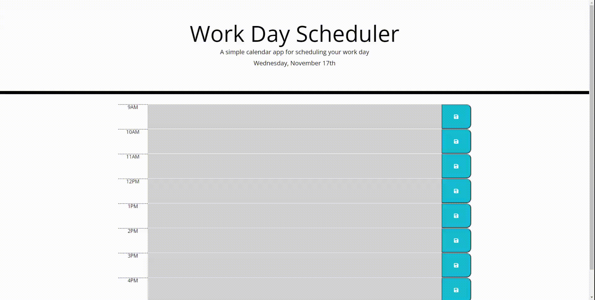

# Challenge-5-Work-Scheduler
This is challenge 5 of the Bootcamp. A work day scheduler with color coding and local storage saving capabilities. Written and designed by myself.

## Installation
1. Download or clone the Repository
2. Open the main page (index.html) on your browser to view webpage
3. Use of Visual Studio is recommended to view all coding.

## Instructions
1. To edit the task/description of the timeslot desired, just click on that hours block.
2. Once done inputting desired task/description, click save icon to left of time slot.

## Coding Used
* HTML
* CSS
* Javascript

## Demo

## Websites
* Deployed Application: https://dsiedlarz90.github.io/Challenge-5-Work-Scheduler/
* Github Repository: https://github.com/DSiedlarz90/Challenge-5-Work-Scheduler